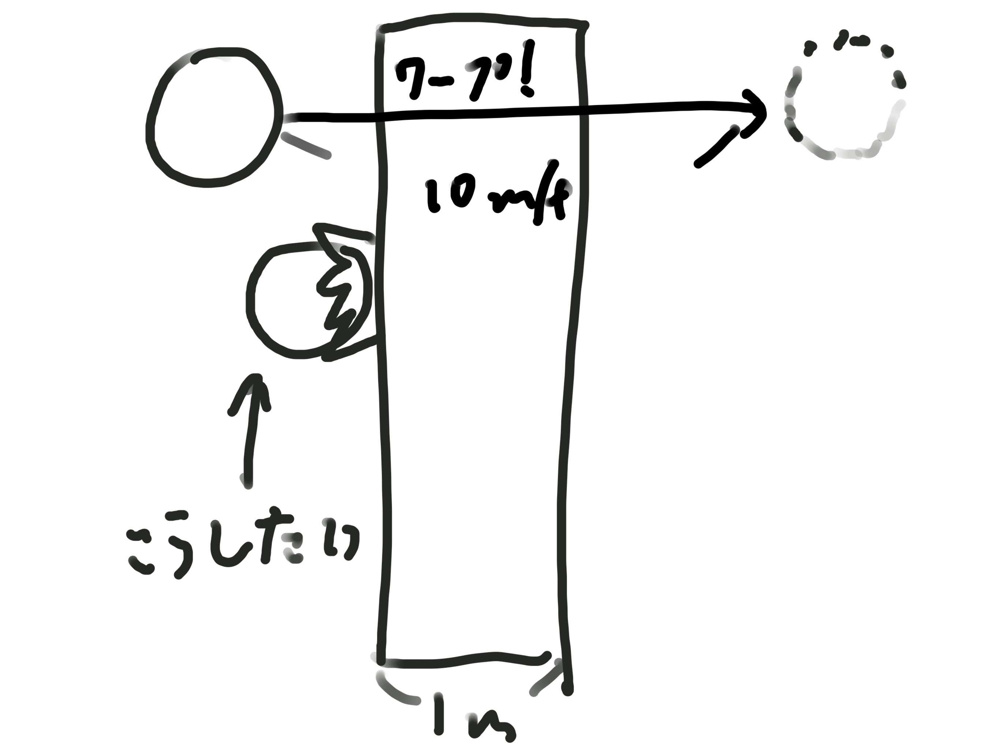
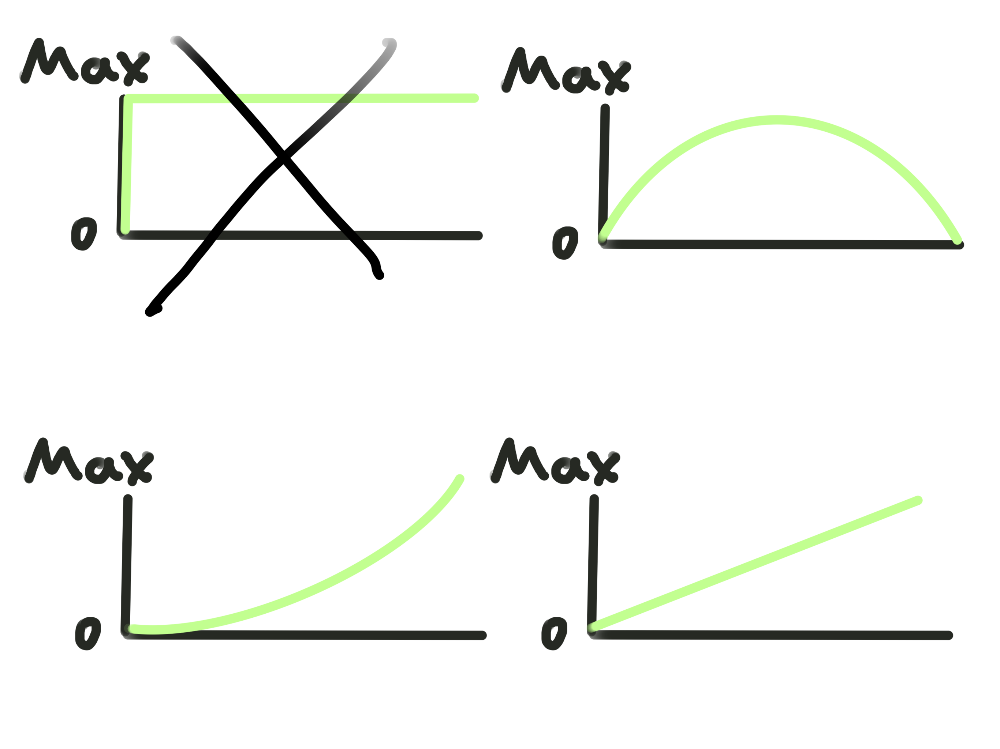

## この記事について
今回は、unityの移動について私の知ってる範囲で書いていきたいと思います。

unityの移動について、それぞれのコードとメリットとデメリットについて具体的に書いていきます。まだまだ試せていない部分等ありますので、あくまで参考程度にしていただけると幸いです。

加筆修正してして最強にできたらいいなぁ。

中編→https://henohenon.github.io/portfolio/blogs/?blog=2023-12-13
後編→https://henohenon.github.io/portfolio/blogs/?blog=2023-12-21


## 前提知識
移動の方法について、なぜこのような種類があるのか、どのような仕組みで行われているのかを大雑把に書きます。なんとなくわかってるよーって方は飛ばしてもらって大丈夫です。

まず、unityの移動には`transform.Translate`やら`rigidbody.velocity`など様々な種類があります。ですが、実はすべて途中式が違うだけで、最終的には`transform.positon`をしています。

### transform.Translate
ではなぜこんなにも種類があるのか。例えば`transform.Translate`ですが、これは今の位置から指定した座標分移動する。という処理です。
```C#
transform.Translate(0, 0, -0.1f);
```
ではこれを`transform.positon`で実装してみましょう。
```C#
transform.position = transform.position + new Vector3(0, 0, -0.1f);
```
挙動自体は変わらないのですが、このようにとても長くなってしまいます。~~...どっちでもいいって？私もそう思いま~~
(自分の好みやケースに応じて使いやすい方を選択するとよいかと。)

### transform.positionの諸問題
さて。`transform.position`ですが、よく壁などの判定を貫通します(致命的)。ワープ的な移動をしているため、高速で移動するモノを実装した際、壁の向こうにワープしてしまうというわけです。<br>


他にも、重力や加速度的な移動の実装が難しいという問題があります。<br>
現実世界で走り出す場合、移動速度は次第に上がって最高速度に到達するはずです。止まるときも、ジャンプするときも同様で、少なくとも0から最大になることはまずありえないでしょう。<br>


### rigidbody
このような問題を解消するために、unityには`rigidbody`というコンポーネントが存在します。<br>
これは、当たり判定を考慮した移動を提供してくれるとともに、ボタン一つで重力の影響が与えられるようになり、摩擦を考慮した移動を実行してくれます。(ここまでだとまるで万能の救世主のようですが、実際はそんなことはないです。ありがたいけどね。)

---
前編はここまでです！ありがとうございました！<br>
中編→https://henohenon.github.io/portfolio/blogs/?blog=2023-12-13